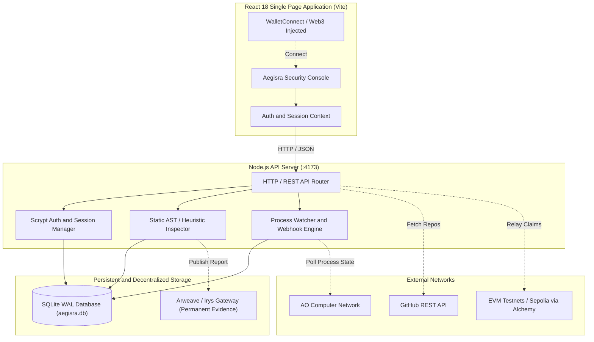

<div align="center">

# 🛡️ Aegisra

**Security inspection, monitoring, and verification for decentralized applications.**

[](https://react.dev/)
[](https://nodejs.org/)
[](https://vitejs.dev/)
[](https://www.sqlite.org/)
[](https://arweave.org/)
[](LICENSE)
[](https://github.com/Henilt31/aegisra/pulls)

<p align="center">
  <a href="#what-is-aegisra"><strong>Explore Features »</strong></a>
  <br />
  <br />
  <a href="#quick-start">Quick Start</a>
  ·
  <a href="#system-architecture">Architecture</a>
  ·
  <a href="#configuration--environment">Config</a>
  ·
  <a href="#api-reference">API Docs</a>
</p>

</div>

---

## 📖 What is Aegisra?

Building decentralized applications introduces a unique and critical class of security challenges. 

A contract or process can look syntactically correct during development but behave unexpectedly after deployment under adversarial conditions. Furthermore, traditional point-in-time code reviews fail to provide continuous, dynamic visibility into what a deployed autonomous process or contract is executing in real-time.

**Aegisra** bridges this gap by unifying pre-deployment static vulnerability analysis with post-deployment runtime telemetry into a single, high-performance security workflow.

```text
                    AEGISRA
                       │
          ┌────────────┴────────────┐
          │                         │
     BEFORE DEPLOYMENT          AFTER DEPLOYMENT
          │                         │
     Source Inspection          Runtime Monitoring
          │                         │
     Security Findings          Process Activity
          │                         │
     Risk Assessment            Alerts / Events
          │                         │
          └────────────┬────────────┘
                       │
                  Verification
                       │
             Immutable Evidence
```

---

## ✨ Key Features

### 🔍 Pre-Deployment Static Source Inspection
- **Pattern-Matching Heuristics**: Identifies privileged execution paths (`onlyOwner`, `msg.sender`), unprotected external value transfers, vulnerable message handlers (`Handlers.add`, `ao.send`), and timestamp dependencies.
- **Automated Risk Scoring**: Calculates deterministic security scores (0–100) and classifies audits as `reviewed` or `attention` based on severity.
- **GitHub Repository Analysis**: Inspects public GitHub repositories on-the-fly without cloning large files.

### 📡 Post-Deployment Runtime Monitoring
- **Process Watchers**: Track AO process IDs and EVM smart contracts continuously.
- **Real-Time Webhook Dispatch**: Configurable HTTPS webhook delivery for security events and anomalous state changes.
- **Delivery Logging**: Full audit trail of dispatched webhook payloads, response codes, and delivery statuses.

### 📜 Cryptographically Verifiable & Immutable Reports
- **Permanent Storage Backing**: Export finalized inspection reports directly to Arweave / Irys / Turbo gateways.
- **Tamper-Proof Audit References**: Generates cryptographically unique sha256 digests (`sourceHash`) and verifiable report hashes.

### 🔐 Enterprise-Grade React & Node Foundation
- **Modern Component Architecture**: Built with React 18, Vite, and modular Context-driven state management.
- **Hardened SQLite Engine**: Native SQLite with Write-Ahead Logging (`WAL`) mode enabled, foreign key integrity constraints, and indexed relations.
- **Robust Session Security**: Scrypt password hashing with unique 16-byte random salts and base64url expiring 7-day session tokens.

### 💧 Developer Faucet & EVM Tooling
- **Claim Deduplication**: Built-in testnet faucet dispatcher preventing sybil wallet re-claims.
- **Wallet Integration**: Compatible with WalletConnect and browser-injected web3 providers (MetaMask, Phantom, ArConnect).

---

## 🏗️ System Architecture



---

## 🚀 Quick Start

### Prerequisites
- [Node.js](https://nodejs.org/) `>= 20.0.0` (Node 22 LTS recommended)
- `npm` or `pnpm`

### 1. Clone the Repository
```bash
git clone https://github.com/Henilt31/aegisra.git
cd aegisra
```

### 2. Install Dependencies
```bash
npm install
```

### 3. Configure Environment Variables
Copy the example configuration file:
```bash
cp .env.example .env
```
Edit `.env` with your API credentials (see [Configuration](#-configuration--environment)).

### 4. Build and Start the Application
```bash
# Build React Frontend
npm run build

# Start Production Server
npm start
```
The application will start at **`http://localhost:4173`**.

For active local development with hot module replacement:
```bash
npm run dev
```

---

## ⚙️ Configuration & Environment

| Variable | Description | Example / Default |
| :--- | :--- | :--- |
| `PORT` | Local HTTP server port | `4173` |
| `GITHUB_CLIENT_ID` | GitHub OAuth App Client ID | `Ov23li...` |
| `GITHUB_CLIENT_SECRET` | GitHub OAuth App Client Secret | `db8f7...` |
| `WALLETCONNECT_PROJECT_ID` | WalletConnect Cloud Project ID | `310fdb...` |
| `AO_GATEWAY_URL` | AO network gateway URL for process queries | `https://arweave.net` |
| `ARWEAVE_UPLOAD_URL` | Arweave/Irys/Turbo upload endpoint | `https://node2.irys.xyz/tx` |
| `ARWEAVE_UPLOAD_TOKEN` | Bearer token for immutable report uploads | `your_upload_token` |
| `EVM_RPC_URL` | EVM JSON-RPC provider URL | `https://eth-sepolia.g.alchemy.com/v2/...` |
| `FAUCET_PRIVATE_KEY` | Private key for testnet faucet dispatcher | `0x...` |
| `FAUCET_TOKEN_CONTRACT` | Address of ERC-20 token for faucet distribution | `0x...` |

---

## 🔌 API Reference

### Health & Integrations
- `GET /api/health` — Returns server uptime and active integration status.
- `GET /api/integrations` — Returns feature flags for enabled integrations.

### Authentication
- `POST /api/register` — Create a new account (`email`, `password` ≥ 8 chars).
- `POST /api/login` — Authenticate and receive a 7-day session token.
- `GET /api/me` — Fetch authenticated user profile, saved audits, watches, and claims.

### Security Audits
- `POST /api/audits` — Submit contract or process source code for static analysis and automatic Arweave publication.
- `POST /api/github` — Fetch metadata and code statistics for a GitHub repository.

### Monitoring & Watchers
- `POST /api/watches` — Register a new process ID for surveillance with an optional HTTPS webhook.
- `POST /api/watches/:id/test-alert` — Trigger an instant test alert delivery to the configured webhook.

### Testnet Faucet
- `POST /api/faucet` — Submit an EVM wallet address to claim test allocation.

---

## 🛡️ Security & Integrity Design

1. **Clean Component Architecture**: Modular React components for each layer (Auth, Wallets, Audits, Watchers, Proofs).
2. **Zero Plaintext Secrets**: Passwords use cryptographically secure random 16-byte salts and `scrypt` key derivation.
3. **Session Hardening**: Session tokens are SHA-256 hashed prior to storage and lookups use constant-time comparisons.
4. **Strict Request Validation**: Payloads are capped at 1 MB, URLs require HTTPS protocol enforcement, and SQL parameters use parameterized prepared statements.

---

## 🤝 Contributing

Contributions, issues, and feature requests are welcome!

1. Fork the Project
2. Create your Feature Branch (`git checkout -b feature/AmazingSecurityFeature`)
3. Commit your Changes (`git commit -m 'feat: Add automated reentrancy checker'`)
4. Push to the Branch (`git push origin feature/AmazingSecurityFeature`)
5. Open a Pull Request

---

## 📄 License

Distributed under the **MIT License**. See `LICENSE` for details.

---

<div align="center">

*Built with too much coffee ☕, mathematical precision, and an unwavering obsession with decentralized security.*

</div>
